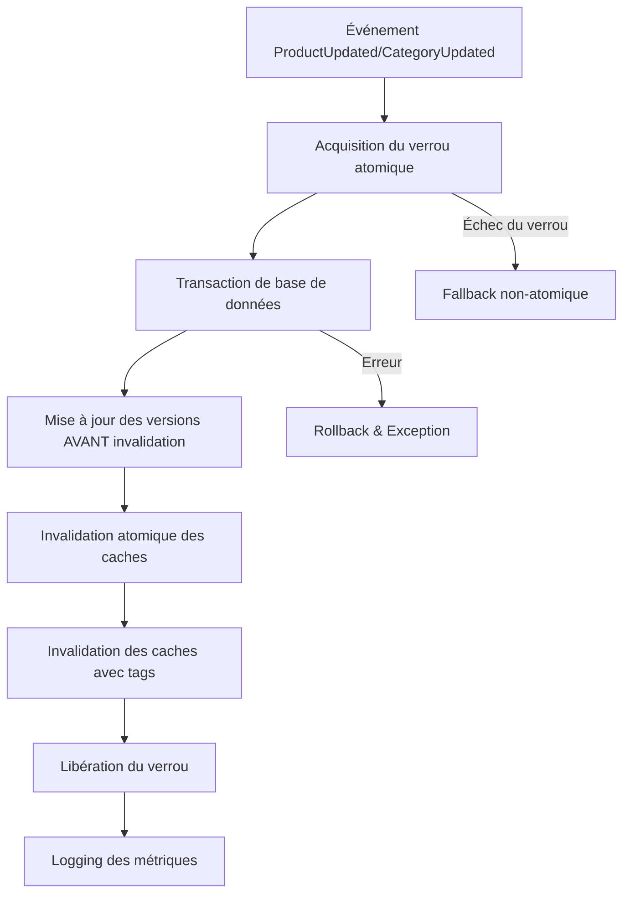

# Opérations de Cache Atomiques

Ce document décrit l'implémentation des opérations de cache atomiques dans le système Monepiceriz pour éviter les conditions de course (race conditions) lors des mises à jour concurrentes.

## 🎯 Objectifs

- **Éviter les race conditions** entre l'invalidation du cache et les mises à jour de timestamps
- **Garantir la cohérence** des calculs de versions durant les événements concurrents
- **Améliorer les performances** en optimisant les opérations batch
- **Monitorer et alerter** sur les problèmes de performance

## 🏗️ Architecture

### Components Principaux

1. **`InvalidateShopCache`** - Listener d'événements avec opérations atomiques
2. **`ShopDataVersion`** - Modèle avec méthodes de versioning atomiques  
3. **`ValidateAtomicCacheOperations`** - Commande de test et validation
4. **`AtomicCacheMonitoring`** - Middleware de monitoring

### Flux d'Opérations Atomiques



## 🚀 Utilisation

### 1. Invalidation Automatique

Les opérations atomiques sont déclenchées automatiquement lors des événements :

```php
// Déclenche l'invalidation atomique
event(new ProductUpdated($product, 'updated'));
event(new CategoryUpdated($category, 'created'));
```

### 2. Mise à Jour Manuelle des Versions

```php
// Mise à jour atomique de plusieurs types
ShopDataVersion::updateVersionsAtomic(['products', 'categories', 'global']);

// Fallback vers l'ancienne méthode
ShopDataVersion::updateVersions(['products']);
```

### 3. Validation et Réparation

```php
// Commande Artisan pour les tests
php artisan cache:validate-atomic

// Avec tests de concurrence
php artisan cache:validate-atomic --test-concurrency --stress-test=50

// Nettoyage et réparation
php artisan cache:validate-atomic --clear-cache --repair
```

### 4. Monitoring des Performances

```php
// Récupérer les métriques actuelles
$metrics = AtomicCacheMonitoring::getCurrentMetrics();

// Récupérer les incidents récents
$incidents = AtomicCacheMonitoring::getRecentIncidents(24);
```

## ⚙️ Configuration

### Paramètres de Verrous

```php
// Dans InvalidateShopCache
private const ATOMIC_LOCK_TIMEOUT = 5; // 5 secondes
private const LOCK_RETRY_ATTEMPTS = 3;
private const LOCK_RETRY_DELAY = 100; // 100ms

// Dans ShopDataVersion  
private const VERSION_LOCK_TIMEOUT = 10; // 10 secondes
```

### Seuils de Monitoring

```php
// Dans AtomicCacheMonitoring
private const PERFORMANCE_THRESHOLD_MS = 1000; // 1 seconde
private const ERROR_RATE_THRESHOLD = 0.05; // 5%
```

## 🔧 Mécanismes de Protection

### 1. Verrous Distribués

- **Verrous Redis/Memcached** avec timeout automatique
- **Retry logic** avec backoff exponentiel
- **Fallback** vers opérations non-atomiques en cas d'échec

### 2. Transactions de Base de Données

- **Isolation REPEATABLE READ** pour la cohérence
- **Rollback automatique** en cas d'erreur
- **Upsert atomique** pour éviter les conditions de course

### 3. Gestion des Erreurs

- **Circuit breaker** avec seuils configurables
- **Mesures d'urgence** automatiques
- **Logging détaillé** pour le debugging

## 📊 Monitoring et Alertes

### Métriques Collectées

- **Durée des opérations** (min, max, moyenne)
- **Taux de succès/erreur**
- **Compteurs d'alertes**
- **Incidents avec actions correctives**

### Alertes Automatiques

- **Performance dégradée** (> 1 seconde)
- **Taux d'erreur élevé** (> 5%)
- **Verrous bloqués** détectés et nettoyés

### Logs Structurés

```json
{
  "level": "info",
  "message": "Atomic cache invalidation completed successfully",
  "context": {
    "data_types": ["products", "global"],
    "invalidated_keys": 8,
    "duration_ms": 45.32
  }
}
```

## 🧪 Tests et Validation

### Tests Automatisés

1. **Test de mise à jour atomique** - Vérifie la cohérence des timestamps
2. **Test de cohérence** - Détecte les doublons de timestamps/hashes
3. **Test d'invalidation** - Valide la suppression atomique des caches
4. **Tests de concurrence** - Simule des opérations simultanées

### Commandes de Diagnostic

```bash
# Tests complets avec concurrence
php artisan cache:validate-atomic --test-concurrency --stress-test=100

# Réparation des incohérences
php artisan cache:validate-atomic --repair

# Nettoyage complet
php artisan cache:validate-atomic --clear-cache
```

## 🚨 Gestion des Incidents

### Détection Automatique

- **Seuils de performance** configurables
- **Monitoring du taux d'erreur** en temps réel
- **Détection de verrous bloqués**

### Actions Correctives

1. **Nettoyage automatique** des verrous expirés
2. **Réinitialisation des métriques** en cas de fausses alertes
3. **Fallback** vers les méthodes legacy
4. **Logging détaillé** pour l'analyse post-incident

### Escalade

- **Logs WARNING** pour les performances dégradées
- **Logs CRITICAL** voor les taux d'erreur élevés
- **Notifications** pour les mesures d'urgence déclenchées

## 🔍 Debugging

### Logs Utiles

```bash
# Filtrer les logs d'opérations atomiques
tail -f storage/logs/laravel.log | grep "Atomic cache"

# Surveiller les verrous
tail -f storage/logs/laravel.log | grep "lock"

# Vérifier les métriques
tail -f storage/logs/laravel.log | grep "performance"
```

### Clés de Cache à Surveiller

- `atomic_cache_metrics.performance` - Métriques globales
- `atomic_cache_metrics.alerts.*` - Compteurs d'alertes
- `atomic_cache_metrics.incidents.*` - Historique des incidents
- `inertia.data.version` - Version globale calculée
- `shop.version.*` - Versions par type de données

## 📈 Optimisations Futures

### Améliorations Possibles

1. **Partitioning des verrous** par type de données
2. **Cache distribué** pour les grandes installations
3. **Métriques en temps réel** avec WebSockets
4. **Dashboard de monitoring** intégré

### Considérations de Performance

- **Redis Cluster** pour la scalabilité
- **Pipeline Redis** pour les opérations batch
- **Compression des données** de cache volumineuses
- **TTL adaptatif** basé sur la fréquence d'accès

## 🔐 Sécurité

### Protection des Verrous

- **Identifiants uniques** pour éviter les collisions
- **Timeout obligatoire** pour éviter les blocages
- **Validation des permissions** pour les opérations critiques

### Audit Trail

- **Logging de toutes les opérations** critiques
- **Traçabilité des modifications** de versions
- **Métriques de sécurité** sur les tentatives d'accès

## 📚 Références

- [Laravel Cache Locks](https://laravel.com/docs/cache#atomic-locks)
- [Redis Distributed Locks](https://redis.io/docs/manual/patterns/distributed-locks/)
- [Database Transaction Isolation](https://dev.mysql.com/doc/refman/8.0/en/innodb-transaction-isolation-levels.html)
- [Monitoring Best Practices](https://12factor.net/logs) 