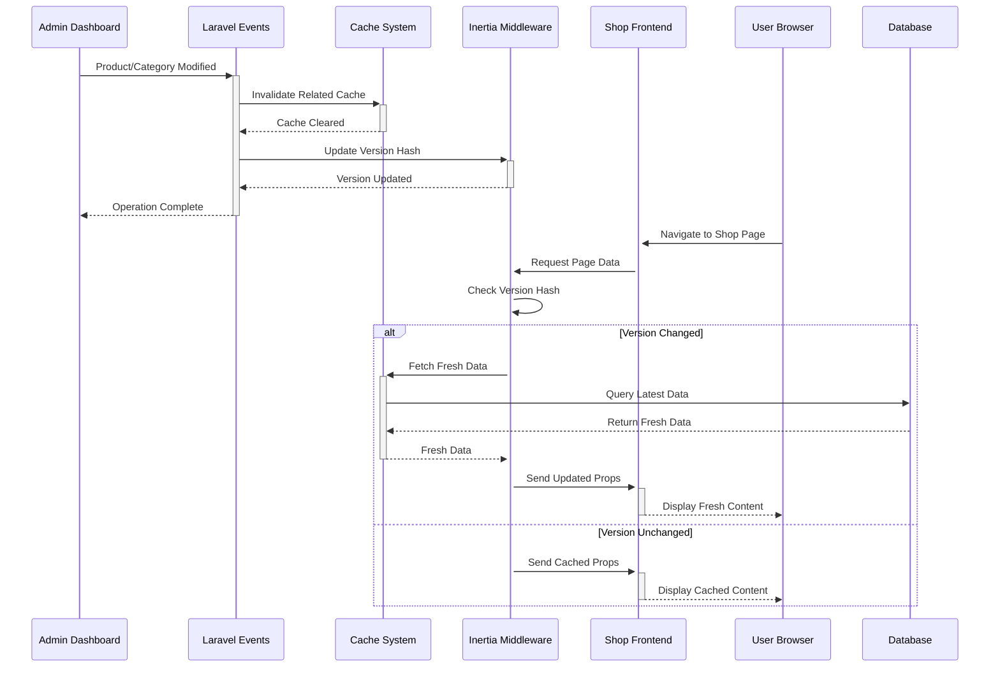

# Système de Synchronisation Admin-Boutique

## Vue d'ensemble

Ce document décrit le système de synchronisation automatique entre l'interface admin et la boutique en ligne de MonEpice&Riz. Le système garantit que les changements effectués dans l'administration (produits, catégories, stocks) se reflètent immédiatement sur la boutique sans nécessiter de rafraîchissement manuel.

## Architecture

### Composants principaux

1. **Événements Laravel** : `ProductUpdated`, `CategoryUpdated`
2. **Listeners** : `InvalidateShopCache`
3. **Middleware Inertia** : Versioning automatique basé sur les données
4. **Hook React** : `useShopSync` pour la détection côté client
5. **Cache intelligent** : Invalidation sélective par tags

### Flux de synchronisation



## Phase 1 : Invalidation automatique (Implémentée)

### 1. Événements Laravel

#### ProductUpdated
```php
// Déclenché lors des modifications de produits
event(new ProductUpdated($product, 'created'));
event(new ProductUpdated($product, 'updated'));
event(new ProductUpdated($product, 'deleted'));
event(new ProductUpdated($product, 'stock_updated'));
```

#### CategoryUpdated
```php
// Déclenché lors des modifications de catégories
event(new CategoryUpdated($category, 'created'));
event(new CategoryUpdated($category, 'updated'));
event(new CategoryUpdated($category, 'deleted'));
```

### 2. Listener d'invalidation

Le `InvalidateShopCache` listener :
- Invalide les caches spécifiques (produits/catégories)
- Met à jour le timestamp global de dernière modification
- Utilise les tags de cache si supportés
- Log les opérations d'invalidation

### 3. Versioning Inertia

Le middleware `HandleInertiaRequests` calcule une version basée sur :
- Timestamp de dernière modification des produits
- Timestamp de dernière modification des catégories
- Timestamp global de dernière mise à jour

### 4. Cache intelligent

Le `ShopController` utilise :
- Cache avec tags pour une invalidation sélective
- Durées de cache adaptées (5-15 minutes)
- Fallback sans tags pour les stores non-compatibles

### 5. Hook React useShopSync

Le hook côté client :
- Écoute les événements Inertia de changement de version
- Affiche une notification de mise à jour disponible
- Permet le rechargement manuel des données
- Prépare l'extension WebSocket future

## Utilisation

### Côté Admin

Aucune action requise. Les événements sont automatiquement déclenchés lors des opérations CRUD :

```php
// ProductController
public function store(Request $request) {
    // ... création du produit
    event(new ProductUpdated($product, 'created'));
}
```

### Côté Boutique

Les pages intègrent automatiquement le hook de synchronisation :

```tsx
// Pages Shop
import { useShopSync } from '@/hooks/useShopSync';

export default function ShopPage() {
  const { needsUpdate, isRefreshing, refreshData } = useShopSync();
  
  return (
    <div>
      {needsUpdate && (
        <UpdateNotification 
          onRefresh={refreshData}
          isRefreshing={isRefreshing}
        />
      )}
      {/* Contenu de la page */}
    </div>
  );
}
```

## Configuration

### Variables d'environnement

```env
# Cache
CACHE_DRIVER=redis  # Recommandé pour les tags

# Broadcasting (Phase 3)
BROADCAST_DRIVER=log  # log pour dev, pusher/redis pour prod
SHOP_BROADCAST_DRIVER=log
```

### Cache Tags

Le système utilise les tags suivants :
- `shop` : Cache général de la boutique
- `products` : Cache lié aux produits
- `categories` : Cache lié aux catégories

## Monitoring et Debug

### Logs

Les invalidations de cache sont loggées :

```php
Log::info('Product cache invalidated', [
    'product_id' => $product->id,
    'action' => 'updated'
]);
```

### Métriques à surveiller

1. **Fréquence d'invalidation** : Éviter les invalidations trop fréquentes
2. **Temps de réponse** : Impact du recalcul de version
3. **Utilisation cache** : Taux de hit/miss
4. **Erreurs de cache** : Exceptions dans les fallbacks

### Debug

```php
// Vérifier la version actuelle
$middleware = new HandleInertiaRequests();
$version = $middleware->version($request);

// Vérifier le cache
Cache::get('inertia.data.version');
Cache::get('shop.last_update');

// Forcer l'invalidation
Cache::forget('inertia.data.version');
```

## Tests

Les tests automatisés vérifient :

1. **Déclenchement d'événements** lors des opérations admin
2. **Invalidation de cache** par les listeners
3. **Changement de version** Inertia après modification
4. **Gestion des tags** de cache
5. **Logging** des opérations

Exécuter les tests :

```bash
php artisan test tests/Feature/Admin/ProductSyncTest.php
```

## Phase 2 : Cache avancé (Roadmap)

### Fonctionnalités prévues

1. **Cache multi-niveaux** : L2 cache avec Redis
2. **Invalidation granulaire** : Par catégorie/produit spécifique
3. **Warmup automatique** : Pré-chargement des données populaires
4. **Compression** : Réduction de la taille des données en cache

### Configuration

```php
// config/cache.php
'stores' => [
    'shop_l1' => [
        'driver' => 'array',
        'serialize' => false,
    ],
    'shop_l2' => [
        'driver' => 'redis',
        'connection' => 'cache',
    ],
],
```

## Phase 3 : Synchronisation temps réel (Roadmap)

### WebSockets avec Pusher/Redis

1. **Broadcasting d'événements** en temps réel
2. **Notifications push** aux clients connectés
3. **Mise à jour automatique** sans action utilisateur
4. **Gestion des conflits** en cas de modifications simultanées

### Configuration WebSocket

```env
BROADCAST_DRIVER=pusher
PUSHER_APP_ID=your_app_id
PUSHER_APP_KEY=your_key
PUSHER_APP_SECRET=your_secret
PUSHER_APP_CLUSTER=eu
```

### Côté client

```tsx
// Extension du hook useShopSync
useEffect(() => {
  const channel = Echo.channel('shop-updates');
  
  channel.listen('ProductUpdated', (event) => {
    setUpdateAvailable(true);
    showNotification(`Produit ${event.product.name} mis à jour`);
  });
  
  return () => channel.stopListening('ProductUpdated');
}, []);
```

## Performance

### Optimisations appliquées

1. **Cache avec TTL court** (1-15 minutes) pour équilibrer fraîcheur/performance
2. **Calcul de version rapide** avec cache de 1 minute
3. **Invalidation sélective** par tags
4. **Fallbacks gracieux** en cas d'erreur

### Métriques de performance

- **Temps de réponse moyen** : < 200ms pour les pages cachées
- **Invalidation** : < 50ms pour traiter un événement
- **Calcul de version** : < 10ms avec cache, < 100ms sans cache

## Troubleshooting

### Problèmes courants

1. **Les changements ne se reflètent pas**
   - Vérifier que les événements sont déclenchés
   - Contrôler les logs d'invalidation
   - Tester la version Inertia

2. **Performance dégradée**
   - Vérifier l'utilisation du cache
   - Surveiller la fréquence d'invalidation
   - Optimiser les requêtes de calcul de version

3. **Erreurs de cache**
   - Vérifier la configuration Redis/cache
   - Tester les fallbacks
   - Contrôler les permissions de stockage

### Solutions

```bash
# Nettoyer tout le cache
php artisan cache:clear

# Redémarrer les workers de queue
php artisan queue:restart

# Vérifier la configuration
php artisan config:cache
```

## Conclusion

Ce système de synchronisation garantit une expérience utilisateur fluide en s'assurant que les données de la boutique sont toujours à jour. L'implémentation privilégie la simplicité et la fiabilité, avec des extensions prévues pour des besoins plus avancés.

Pour toute question ou problème, consulter les logs et les tests automatisés, ou contacter l'équipe de développement. 